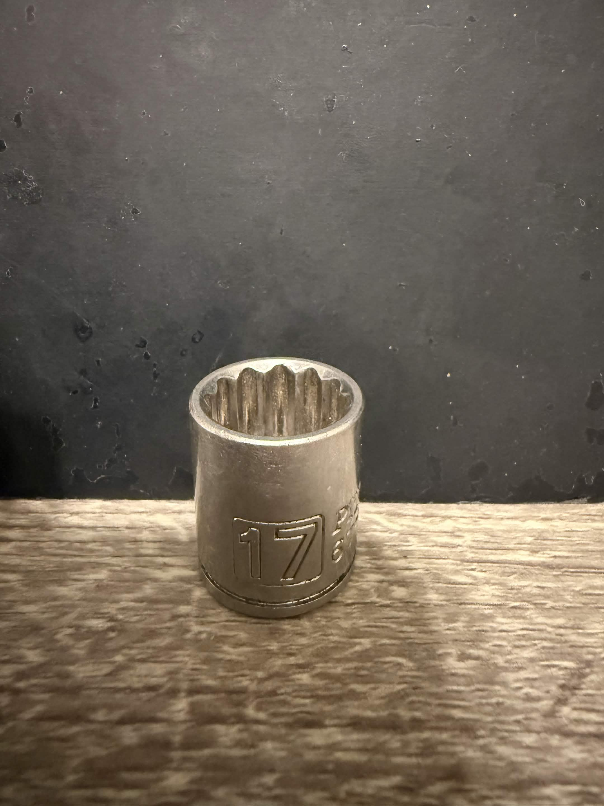
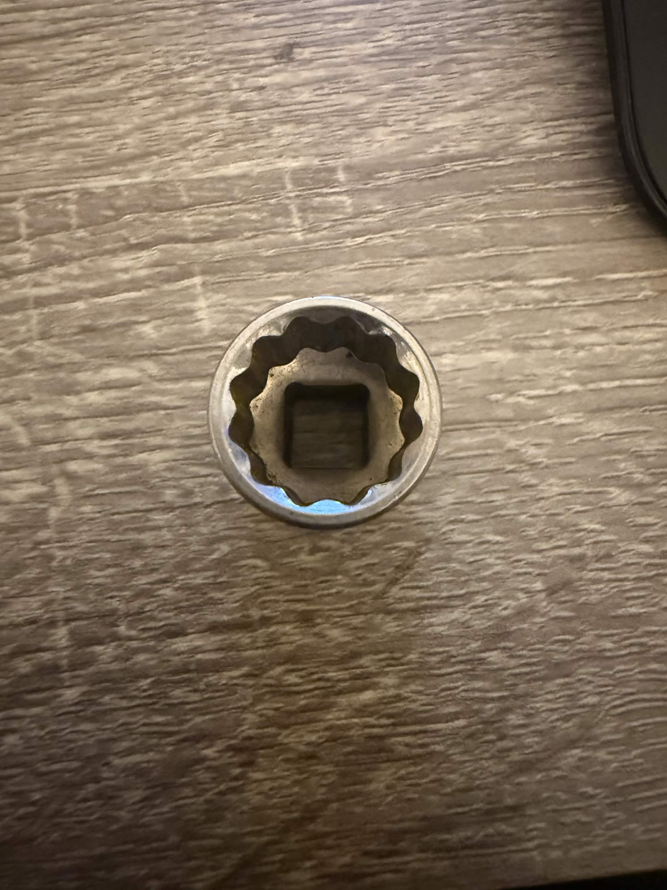
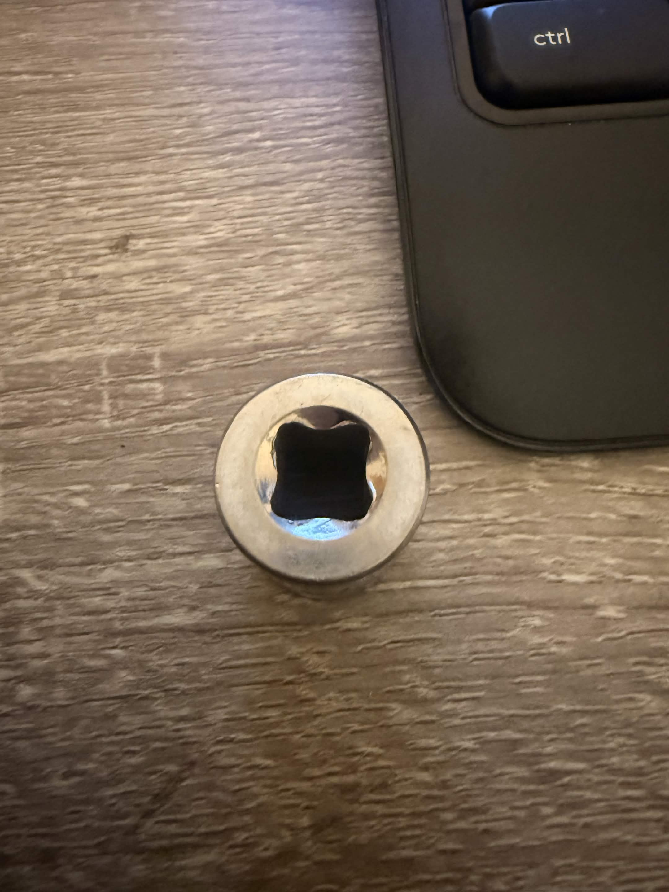

# A1 – Build Your Portfolio

## Objective

The objective is to create a professional engineering portfolio using MkDocs on GitHub, modify certain components, and analyze other engineers' portfolios to understand what a portfolio should look like. You will also analyze, decide, and communicate your work in a professional, detailed manner. 

## Analyze
### Task A: Portfolio Analysis
(https://natekarau61.github.io/Engineering-Portfolio/index.html#home)

**A. Navigability:**
Nate's portfolio lets you navigate between his information and other tabs in under 60 seconds. From the projects tab, I could locate all his projects, and once I clicked one, it was well documented with specific details and information about the project. Straight and to the point, the reader can choose to read into who Nate is, his work experience, or, as stated before, you can dive straight into his previous projects.

**B. Reproducibility:**
The documentation for the tilt table has enough information that a colleague could reproduce the work without asking questions. That being said, that would be in a perfect world. This project is very well documented, with a 122-slide presentation explaining the initial problem and including pictures that further describe the situation. 

**C. Evidence of Reasoning:**
Nate's tilt table project shows clear evidence of his decisions and how he planned to achieve the final result. It includes a process map that details what the table is supposed to do and explains the performance expectations during the concept evaluation. 

**D. Professional Tone:**
The language behind the tilt table project is detailed and precise about what happened throughout the project. This would attract an employer because of the structure and the evidence behind every choice. The Tone established in the portfolio is direct and gets the message across. 

https://thanhvtran.com/

**A. Navigability:**
Thanh's website is easy to navigate, and readers can reach any specific assignment or project in less than sixty seconds. Most projects are protected under NDAs, but they provide a brief description of his contributions and visuals to show the reader what he was talking about. 

**B. Reproducibility:**
As noted, most of Thanh's projects are protected under NDAs, so the information is limited. The electric motor dynamometer caught my attention, especially since my current job involves engine dynos. The drawings include detailed measurements, but a colleague might not be able to reproduce it without asking logical questions.

**C. Evidence of Reasoning:**
The electric motor Thahn contributed to shows the math behind the dyno but not how decisions were made. He mentions what the dynamometer does and explains that it needs to be balanced to minimize vibrations. The portfolio provides limited evidence to support his decisions, and much of the project is protected under NDAs, so the information he can share is legally limited. 

**D. Professional Tone:**
The portfolio contains a professional tone that meets the standard of a document that could be handed to an employer. It is simple, straight to the point, and clearly conveys who he is and what he has done in the past. The opening page is very minimal but guides you to different areas of interest. 

### Task B: Product Analysis

**Product:** 12 point 17mm 3/8th drive socket

The primary function of a socket is to transmit the torque from a 3/8th drive tool to a 17mm hex or 12-point fastener, allowing the fastener to be tightened or loosened. The design inside the 3/8th square lets a ratchet or extension snap into the slot and stay in place. The 12-point side of the socket lets it seat on a 17mm bolt or nut from multiple positions.

The equation for the socket is T = F * r
where 
- T = applied torque on the socket/fastener (N*m)
* F = force applied to the ratchet or drive tool (N)
+ r = perpendicular distance from the axis of rotation to where the force is applied (m)

One assumption I made was that as long as the socket and fastener remain fully engaged, there will be no slipping between the 17mm head and socket. This would allow the torque to be successfully applied from the tool through the socket to the fastener. 

**Patent Number:** US9718170B2 **Authors:** Daniel M. Eggert, Christopher D. Thompson

**Alternative Solutions:**

- One solution that could solve the same primary function would be to slightly thicken the wall thickness, which would allow the socket to withstand more force.
- Another solution that could solve the primary issue would be to add a rubber grommet inside the socket; the reason behind this is to prevent the fastener from falling.

**Design Decision Analysis:** 
One design decision the original engineer made from the patent page is to modify the point of contact or engagement of the socket head away from the corners of the fastener head; the strength and life of the socket is increased, and the risk of the fastener becoming frictionally locked in the socket or stripped by the socket is decreased. 

## Decide
**1. Homepage Identity:**  
The homepage is one of the most essential parts of a portfolio because it sets the tone and image. It should include links that guide visitors to projects, previous work experience, a resume, contact information, and other items tailored to the portfolio's field. Adding pictures and a name on the initial page is crucial as well because it instantly shows who the page is about. 

**2.Intentional customization:**
One intentional customization I changed was the assignment name tabs. The reasoning was so anyone who opens my portfolio can see what each project is, instead of just seeing A1 or A11. I added names to each assignment to make it easier to manage from project to project.

**3. Documentation Standard:**
I ensure all material and data are accurate, including calculations, research, schematics, and drawings, and I hold them to a standard that reflects honesty, legitimacy, and realism in every decision. 
## Communicate

This section was done in the "About me" section.
