# A2 – Truss Stress Analysis

## Objective
The purpose of this assignment was to design a truss with given parameters and distances from point to point, along with given loads at two of the points. We had a window of 20 to 30 kN to choose from; I chose 25 kN. The original prompt calls for A500 steel, but because SolidWorks doesn't have it, I chose AISI 1020 Steel, Cold-Rolled, and gathered any needed information directly from the SolidWorks Materials tab. I modeled and analyzed the final design in SolidWorks to verify whether it met the required strength and safety factors.

+ Design a lightweight planar truss using A500 steel or an alternative material.
+ Create free body diagrams (FBDs) for joints and critical pins.
+ Calculate the required cross-sectional area of truss elements with a safety factor.
+ Determine pin sizes based on shear forces with a safety factor.
+ Solve equations symbolically and numerically for both truss and pin design.
+ Estimate the total weight of the truss and pins.
+ Create a CAD model with accurate dimensions and connections.
+ Compare CAD weight predictions with hand calculations.
+ Document key engineering lessons learned from the process.

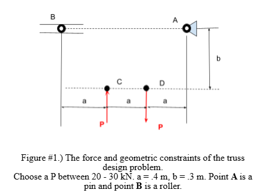
## Analyze

The image shows the boundary and essential factors. The structure had two load points, one at D and one at C; these were 0.4 m apart horizontally. The force at point C was going towards the Joint, and at point D was going away from the Joint. Point A is a pin, and Point B is a roller. Point A is .4m away horizontally and .3m vertically from point D. The same information applies for point B in relation to point C. 

## Decide

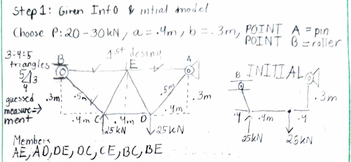

_Which geometry did you select, and why? This is your first open design choice in the course — defend it._

I chose a trapezoid-style geometry with internal beams to increase overall support, while keeping it simple. Using Pythagoras' theorem, I quickly calculated the lengths of BC and AD because they form a 3-4-5 triangle. The structure's symmetry also helped during the calculation process. Although it was an initial sketch, I included as much given information as possible to create a clear visual of my goal.

### Free-Body Diagram

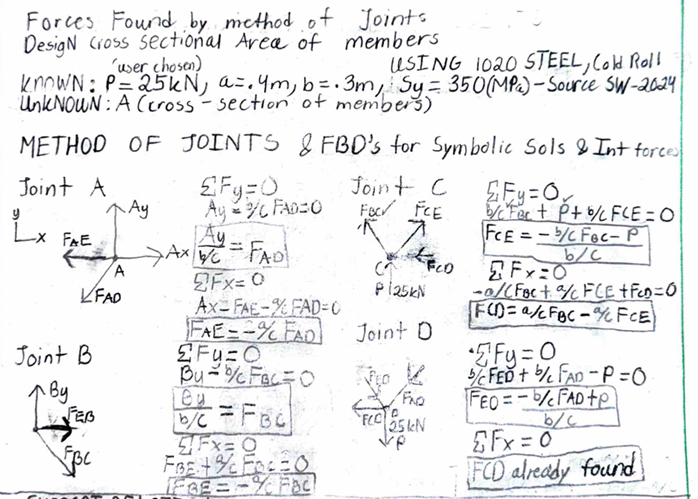

After crafting my initial design, I started creating free-body diagrams for each joint algebraically to understand what was happening before calculating. I solved each Joint to find the horizontal and vertical forces. Although I only had to do one side and could've mirrored the formulas to the other side of the centerline, I solved them all as an extra step to validate my work. There were only seven forces to look for, as that's all the beams in the system. The other purpose behind the FBSs and doing it algebraically first is that your brain isn't focused on numbers just yet; you're using common sense to find equilibria. 

### Supports

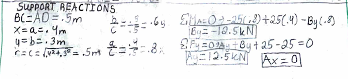

Once I sketched and properly labeled the FBDs with their respective forces, I started finding support reactions before solving for my forces, since these support reactions are essential to solving for internal forces. 

### Numerically Solving Formulas

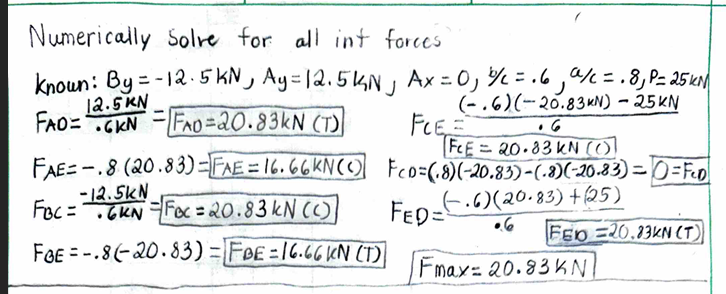

Solving for all my internal forces numerically confirmed the structure is symmetrical and in equilibrium. This set of problems also identifies which beams are in compression and which are in tension; all my internal-force answers are correct, but the ones labeled (c) are members acting in compression, while the other beams are in tension. As shown by the algebraic solution, you needed variables from the support reactions to solve for all internal forces. The way I wrote them down let me start from top to bottom, solving the problem while pulling valuable info from the known variables. 
One thing that stood out during the initial calculations was that there were only two force results, either positive or negative, between 20.83 kN and 16.66 kN. Beam CD ended up being zero, which makes sense as the system is symmetrical. 

### Cross Sectional Area

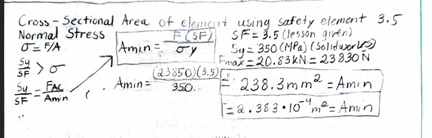

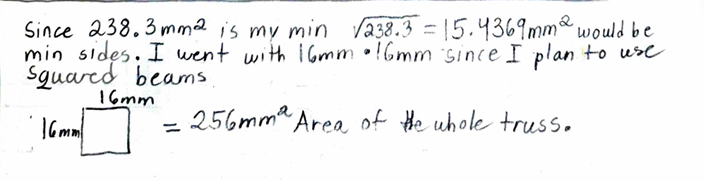

When considering cross-sectional area, I used the minimum required for the truss to work, along with a safety factor. Because the project stated no size limitations, I chose a square beam 16mm by 16mm, for a total area of 256 mm². This also made further calculations simpler, with less room for error, regardless of who is doing the calculations. The reason behind 16mm was that the square root of the minimum cross-sectional area is 15.4369 mm. That being said, you cannot use 15 because the area would be smaller than required.

### Weight
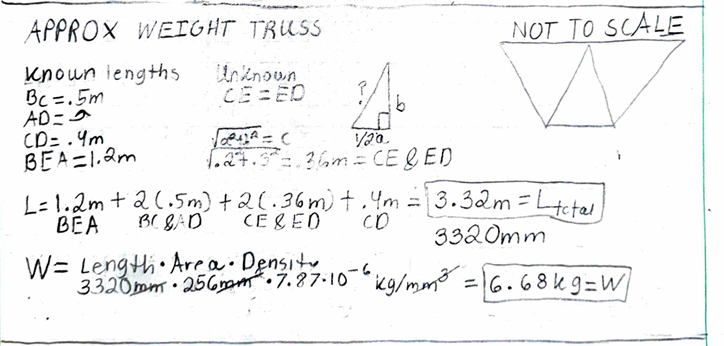

Now that I have the specific area needed for the project to work, I can start figuring out the weight of my truss. Adding all of my beams, I got 3.32 m or 3320mm. The reason for the square root formula in this image was to split the middle triangle to find the real distance of beams CE and DE. This meant that I now had my length, area, and density, which came from SolidWorks. With all these variables, I multiplied them together; the mm units cancel out, leaving kg for the weight: 6.68kg.

### Cross section of Pins 
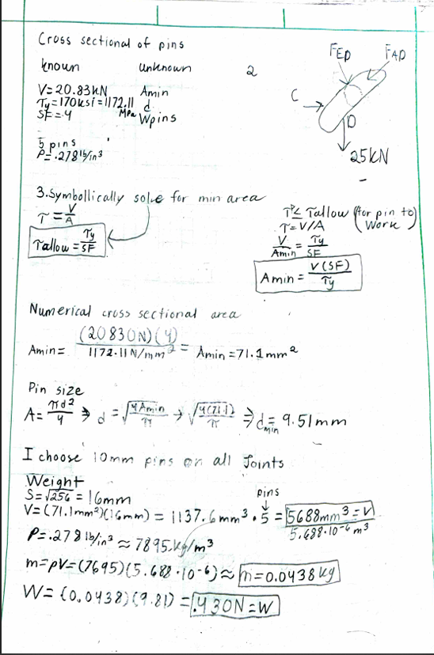
This is all the information used for the pins to determine their cross-sectional area, along with the given yield shear strength and density. I tried to keep the process similar to what I did for the truss: solve algebraically, then solve numerically. 

### CAD Models 
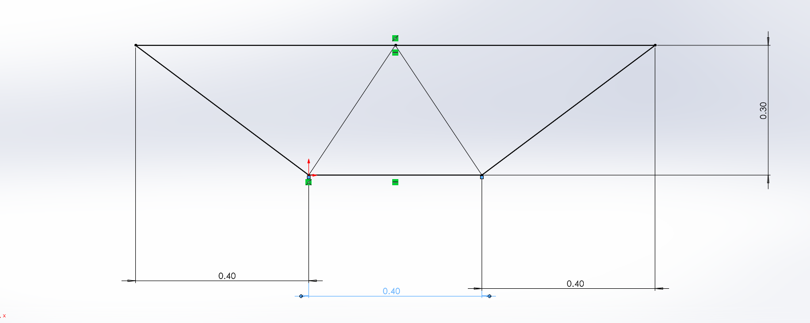
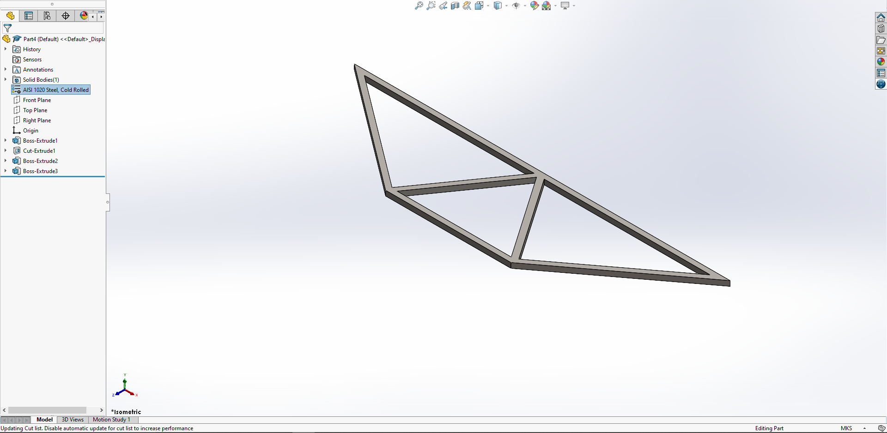

## Communicate

One thing I learned from this project was how challenging it can be to transfer paper calculations into SolidWorks. The paper calculations were a little challenging because there was so much going on. Going through things one step at a time and carefully reviewing everything made it better. I also realized that choosing a simpler design in this situation helps you understand the lesson being taught much better. When designing the pins, I struggled with analyzing the variables behind it. I need to recheck why SolidWorks isn't picking up the truss volume. The properties page for the pin worked smoothly, which makes sense as it is just an extruded pin.

Overall, I spent about 8-10 hours total on research and analysis; the part that took me the most time was getting acclimated to SolidWorks again. I plan to start these projects earlier and quickly develop a way to avoid getting so caught up in the beginning stages, leaving more time to button up the GitHub page and spend more time in SolidWorks.

# CAD FILES
[📦 Download JHA A2 Files](JHA_A2.zip)

