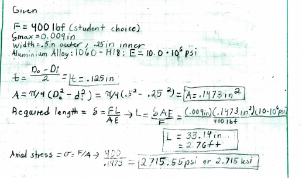
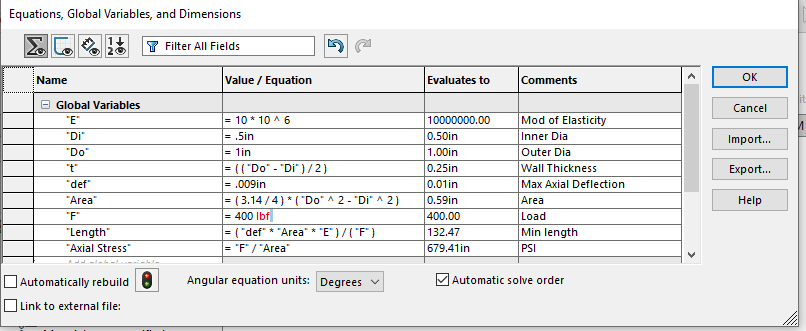
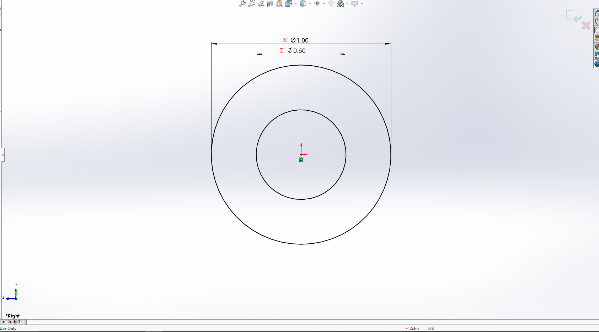
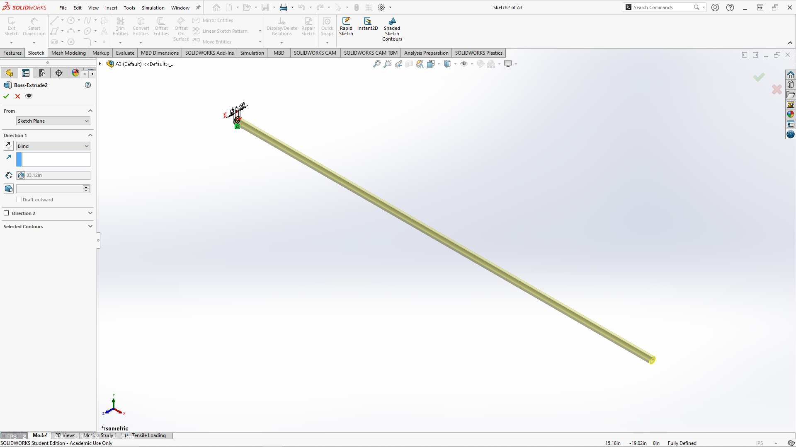
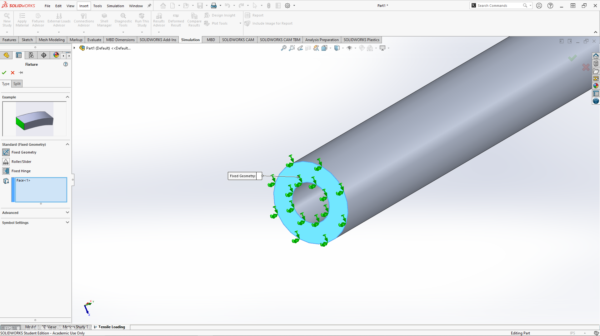
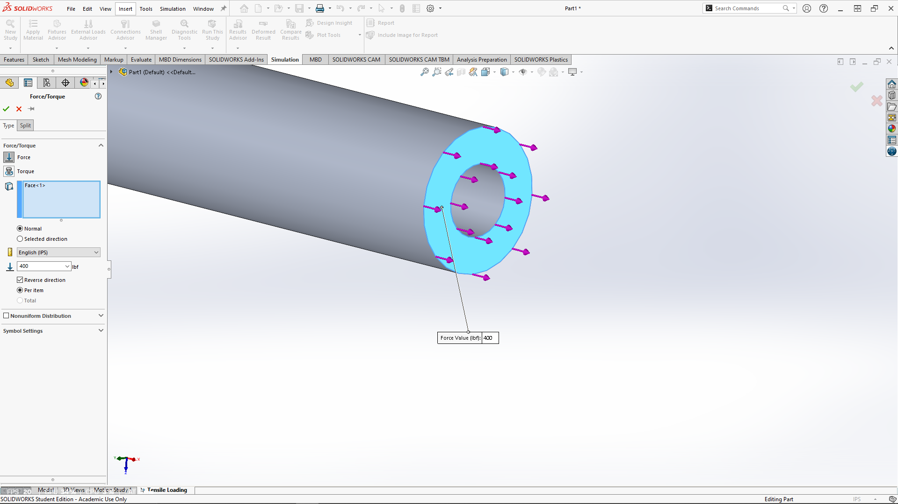
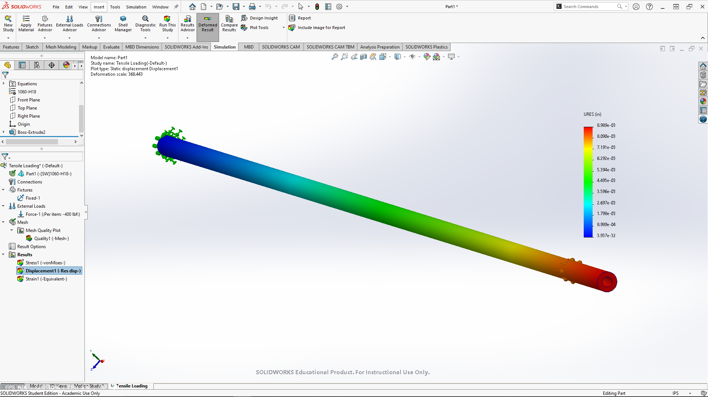
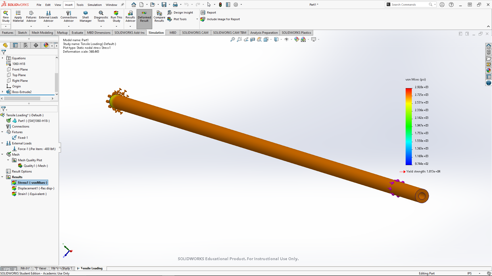
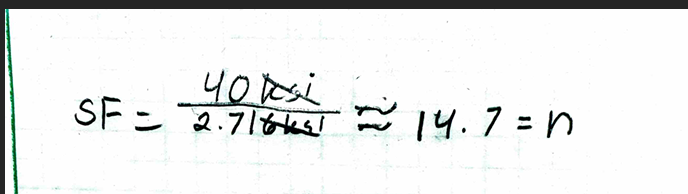
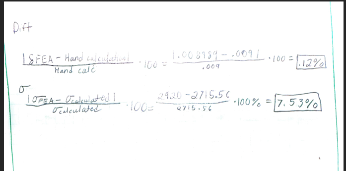

# A3 – Parametric and FEA

## Objective
The objective was to create a beam that we could use for axial deflection modeling based on its dimensions. We used parametric design to determine its overall length. This lesson also introduced me to FEA (Finite Element Analysis) and how to link dimensions to appropriate parameters in your specific CAD software.

## Analyze

**Parametric Design**

I started by writing out my given values and choosing the values I had a decision on. I went with 1060-H18 Aluminum, which, in SolidWorks, has a modulus of Elasticity of 10 * 10^6 Psi. The stress was given .009 inches. The initial design was going to be a solid beam, but due to how low the given stress was, I chose to go with a hollow beam that was .125 in thick with an outer diameter of .5 in. I started by calculating my area, which gave me the last available variable I needed to find the Length of my beam using the equation from Machinery's Handbook, which is δ = FL / AE. Since I have deflection, Force, Area, and modulus of elasticity, I can rearrange my equation to determine my length. Turning it into L = δAE / F. Once I plugged all of my variables into the equation, I got 33.14 in or 2.76 ft.

Now that all of the initial sketching is done, I used the SolidWorks Equation tool to plug in all of my global variables so the design is built with actual calculations and not just input dimensions. To start off, I drew a hollow circle with my chosen dimensions, which were declared as global variables, and the sketch shows the summation symbol right next to the measurement, certifying that the measurement is from the global variables. After that, I extruded the bar to the length figured out by the modified equation from the book, which was also an established equation. Meaning all I had to do was declare the length variable instead of inputting my own dimension.

 

For the FEA setup, I applied a Fixed Geometry fixture to the circular end face on the left side of the bar. This prevents that end of the bar from moving while allowing the rest of the bar to respond to the applied load. I then applied a 400 lbf force to the opposite circular end face of the bar, with the force directed along the longitudinal axis of the tube. This setup represents the bar being held stationary at one end while a direct tensile load is applied to the other end. Using these boundary conditions allows the FEA to model the same direct-tension loading condition used in the hand calculations.

**Finite Element Analysis**

After designing my bar, I ran an FEA to evaluate the deflection and Von Mises stress of the bar under the applied 400 lbf load. The deflection map showed a maximum displacement of approximately 0.008989 in, which is nearly identical to the specified maximum deflection of 0.009 in. This small difference shows that the parametric calculation and FEA results agree very closely. The displacement is essentially zero at the fixed end and gradually increases toward the loaded end, as expected for a bar under direct tension. The deflection results confirm that the designed geometry meets the required stiffness criteria.

**Safety Factor**

The safety factor was determined by comparing the given yield strength of aluminum, 40 ksi, to the calculated axial stress in the bar. The axial stress was calculated using the direct stress equation, F/A, which resulted in a stress of approximately 2.716 ksi. The safety factor was then calculated using the given yield strength divided by 2.716; the ksi cancel out, equaling 14.7. Meaning the calculated stress is well below the specified 40 ksi yield strength. This indicates that the bar should safely withstand the applied 400 lbf load without reaching the given yield strength.

**Design reflection**

The hand calculation resulted in a maximum axial deflection of 0.009 in, while the FEA produced a maximum displacement of 0.008989 in. The percent difference between the two results was calculated to be approximately 0.12%. This is a very small difference, indicating that the analytical calculation and FEA results agree closely. Since the bar has a uniform cross section and is subjected to direct axial tension, the close agreement is expected because the assumptions used in the hand calculation closely represent the conditions modeled in the FEA. 

The hand calculation resulted in an axial stress of approximately 2.716 ksi, while the FEA produced a maximum Von Mises stress of approximately 2.920 ksi. The percent difference between the two results was calculated to be approximately 7.53%. The FEA stress is slightly higher than the analytical result, which can be attributed to the FEA accounting for localized effects near the fixed boundary and the numerical nature of the finite element mesh. Overall, the results are reasonably close, and both results indicate that the bar remains well below the given aluminum yield strength of 40 ksi.

**Stress at Pin**

