# A4 – Motor Mount

## Objective 
The objective of this assignment was to design a motor mount for a brushed motor that is attached to a rigid wall. The primary purpose of the motor mount was to safely support a 300 N applied load while remaining within the specified allowable stress and deflection limits. The design needed to provide sufficient strength to prevent failure while also maintaining adequate stiffness to limit the amount of deformation under the applied load.

To complete the design, I used the equations and design methods provided during lecture to determine the required dimensions of the motor mount. I manipulated the given formulas to solve for the unknown variables and used the material properties of PLA, including its modulus of elasticity and yield strength, to evaluate the strength and stiffness of the design. A safety factor was also incorporated into the calculations to ensure the mount could safely withstand the applied loading conditions.

After determining the required dimensions through the analytical calculations, I created the motor mount in SolidWorks. The CAD model was then used to verify the dimensions and evaluate whether the design met the required stress and deflection criteria. Comparing the calculated results with the SolidWorks results allowed me to verify my design and make sure the final motor mount satisfied the assignment requirements.

## Research

## Feature 1
Feature One serves as the base to which the motor will be bolted. The main design consideration for this feature was determining the minimum width (b), required to support the applied 300 N load while satisfying both the strength and stiffness requirements. I selected a length of 25 mm, which is greater than the motor’s 22 mm diameter, and a height of 30 mm. The remaining unknown dimension was therefore the width (b). 

To determine the required width, I first created a free-body diagram of the feature to identify the loading conditions and resulting bending moment. The 300 N applied force acts at the end of the feature, creating a moment at the fixed wall. I then used the maximum bending stress equation and rearranged it to solve for the minimum width required based on strength. This resulted in a minimum width of approximately 3.32 mm.

I also evaluated the feature based on stiffness by using the maximum deflection equation. This calculation resulted in a required width of approximately 2.12 mm. Since the width required for strength was greater than the width required for stiffness, the strength requirement controlled the design.

Although the calculated minimum width was 3.32 mm, I selected a final width of 5 mm. Choosing a slightly larger dimension provides additional margin while still keeping the feature relatively small. I then substituted the 5 mm width back into the maximum stress equation and obtained a stress of approximately 10 N/mm², which is below the allowable stress of 15.06 N/mm². This confirmed that the selected 5 mm width satisfies the strength requirement.

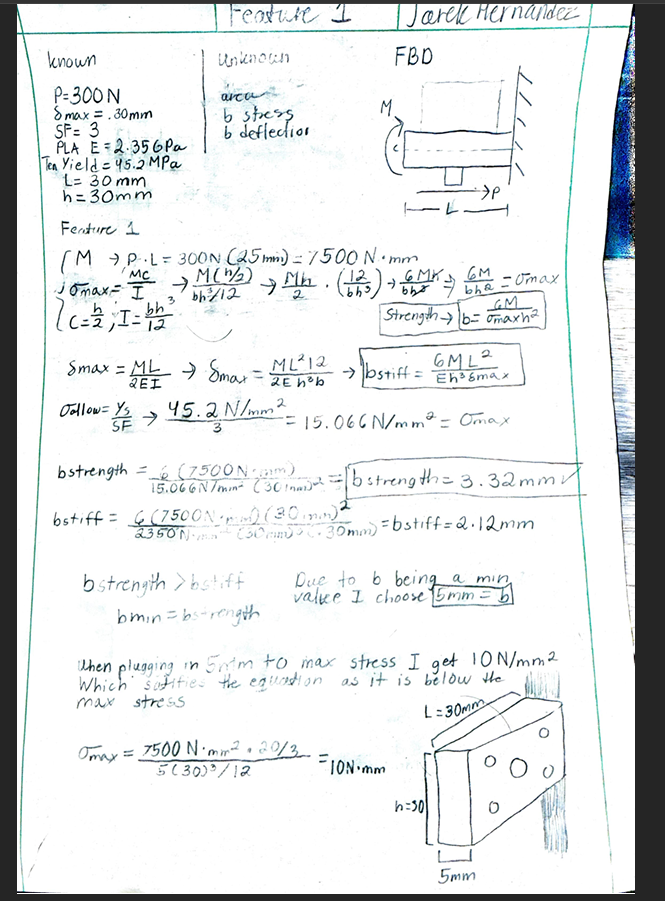

## Feature 2

Feature Two is the mounting section that connects the motor mount to the rigid wall. The primary design consideration for this feature was determining the minimum thickness (b) required to withstand the applied 300 N load while satisfying both the strength and stiffness requirements. I selected a length of 30 mm and a height of 40 mm, leaving the thickness (b) as the primary dimension to be determined.

To determine the required thickness, I first created a free-body diagram to identify the forces acting on the feature and the resulting bending moment at the fixed connection. The applied 300 N load produces a bending moment of 7500 N · mm. I then used the maximum bending stress equation and rearranged it to solve for the minimum thickness required based on strength. This resulted in a minimum thickness of approximately 1.87 mm.

I also evaluated the feature based on stiffness by using the maximum deflection equation. This calculation resulted in a required thickness of approximately .85 mm. Since the thickness required for strength was greater than the thickness required for stiffness, the strength factor controlled the design.

Based on these calculations, I selected a final thickness of 2 mm. This dimension is slightly larger than the calculated minimum required by the strength condition and provides additional margin while maintaining a relatively compact design. As a final check, I substituted the 2 mm thickness into the maximum stress equation and obtained a maximum stress of approximately 14.06 N/mm², which is below the allowable stress of 15.06 N/mm². While the plate is very thin, when being PLA it gets close to the failure point, In future research, I would add some supports and make this plate thicker. 

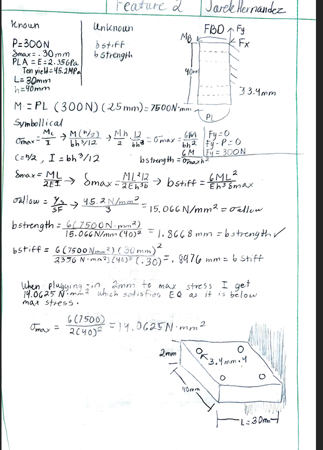

## Isometric Design

I used the values I discovered using my calculations to make a hand-drawn isometric drawing with all of the measurements and holes from the motor mount.

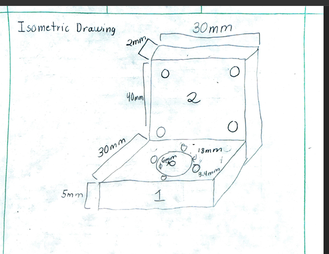

## CAD Models

I started off by putting all of my measurements in the parametric equation table; that way, all of the measurements have a reference for where they came from and not just some random measurement.

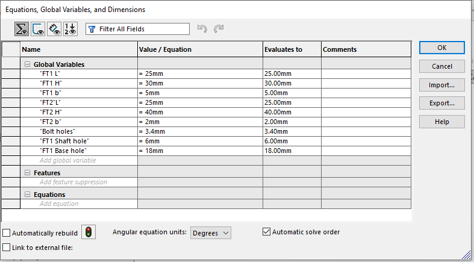

To start off, while I analyzed two features, I made a simple L-shaped bracket and started establishing variables to fully define the shape.

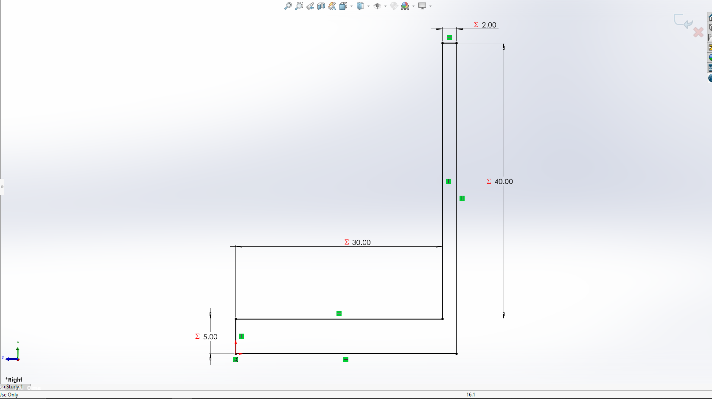

After that, I extruded the bracket to my already established thickness that I calculated in my previous work.

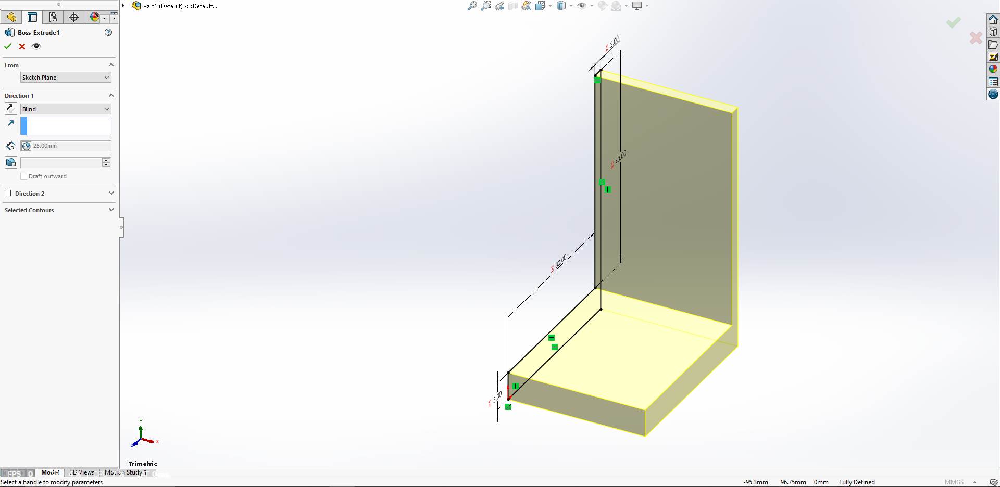

The next step was to cut the holes where the shaft would go through, along with the holes for the screws that would bolt through the mount directly into the motor, along with four holes cut for where the mount would theoretically mount to a fixed surface.

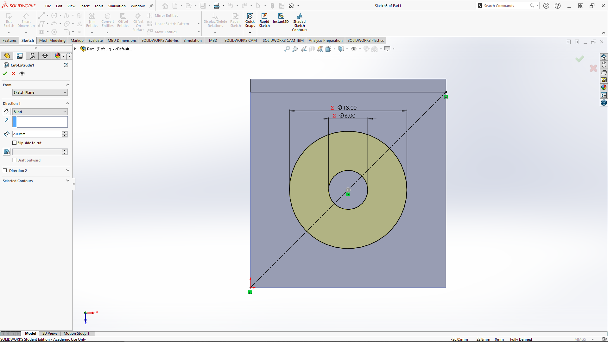
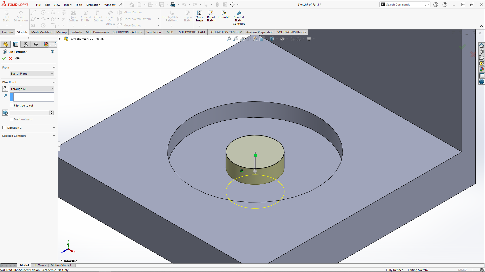
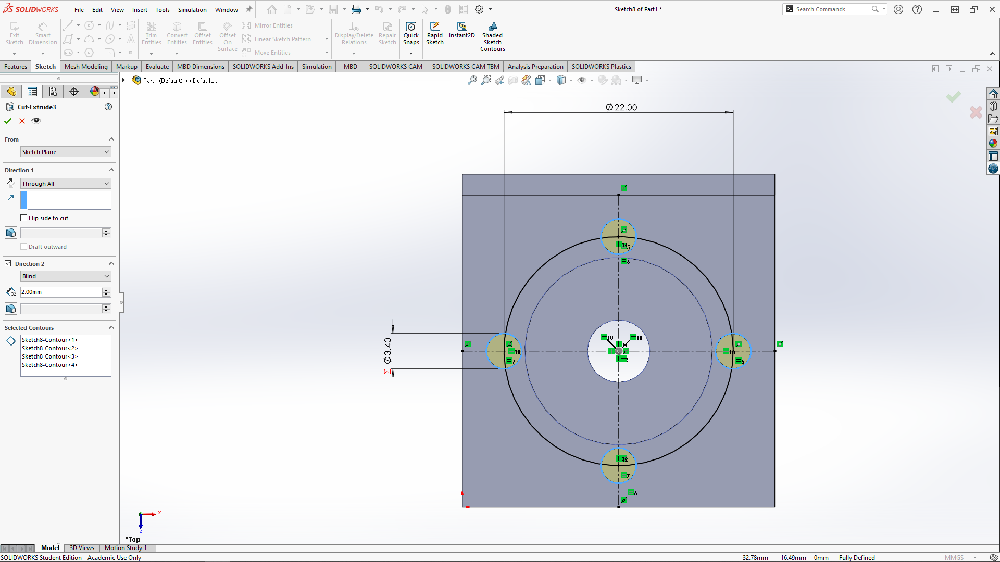
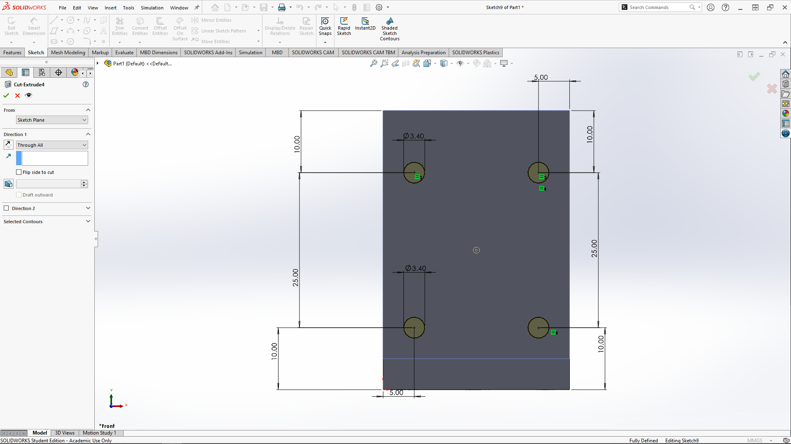
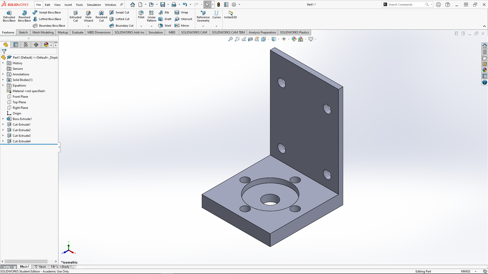
## Analyze

## Decide

## Communicate

