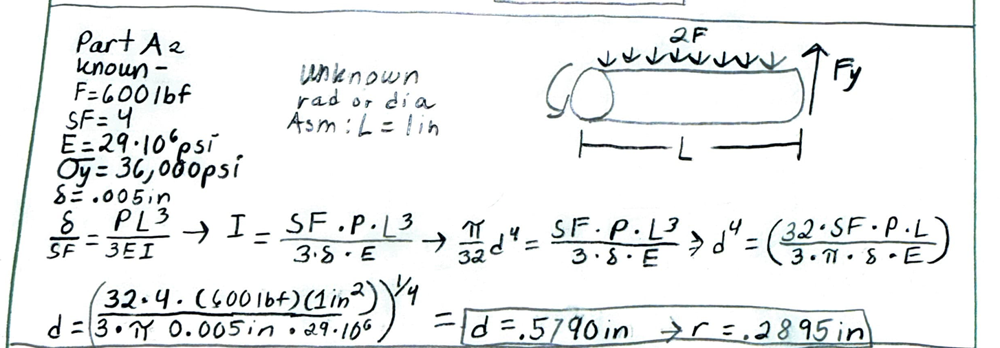
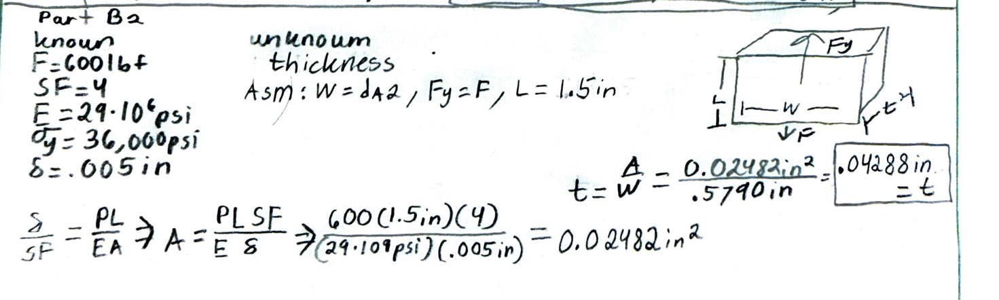
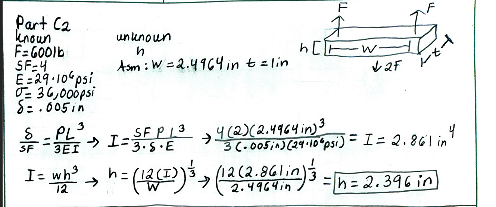
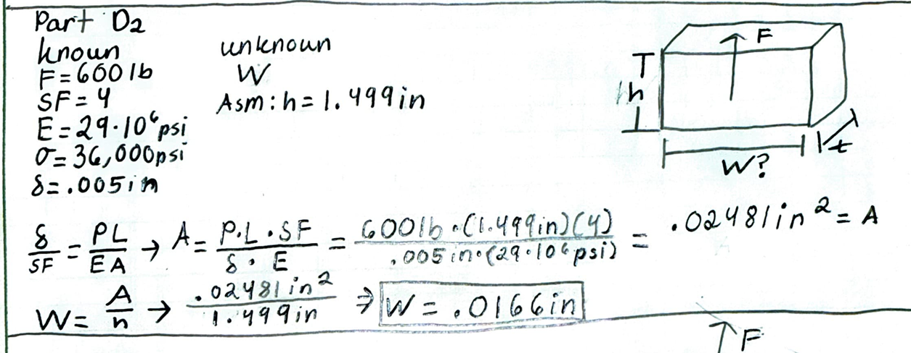
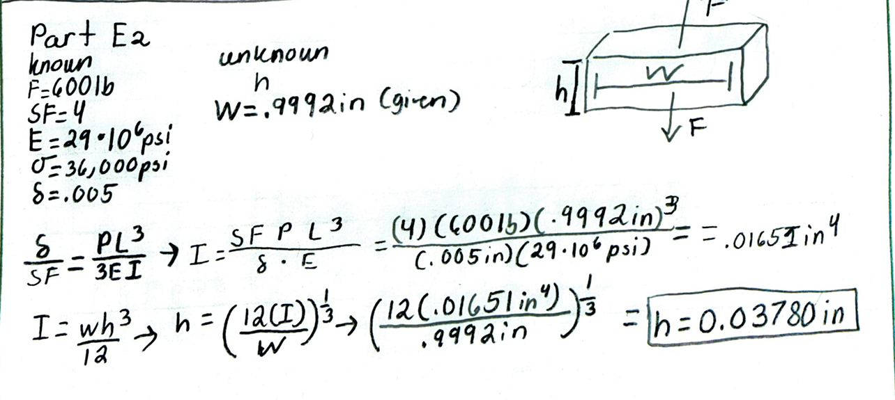
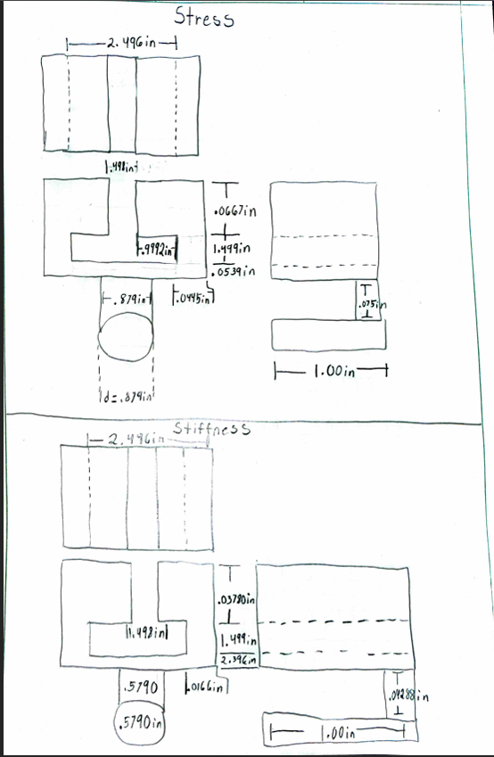

# A5 – Bracket design

## Objective
Objectives:
- Conduct stress analysis to determine appropriate dimensions for structural features.
- Generate free-body diagrams (FBDs) to visualize forces and constraints for each feature.
- Identify and document known and unknown variables, assumptions, and algebraic models for stress calculations.
- Perform stiffness analysis to establish minimum required dimensions based on deflection constraints.
- Compare stress and stiffness analyses to ensure structural integrity and compliance with given constraints.
- Create detailed multiview sketches illustrating dimensions derived from both stress and stiffness analyses.
- Reflect on and document key engineering lessons learned throughout the process.

## Design Process
For my project, I chose a 600 lbf force on all features; Feature A's force doubled because of how the strap is run around the pin. I chose Steel (ASTM A36) with a safety factor of 4. We were given a deflection of .005in, and the properties of steel are a yield strength of 36,000 psi and a modulus of elasticity of 29,000,000 psi. Also, since I'm in 2157, I had to design a link with a running/sliding fit. 

### Bracket Separations

# Part 1: Stress Analysis

**Part A**

For Part A, I began by creating a free-body diagram to identify the loading on the feature. The applied force was 600 lbf, but because of the way the strap is routed around the pin, the feature experiences a doubled load of 1200 lbf. I assumed that the average shear would not cause the feature to fail and treated the feature as a distributed load across the beam.

Using the given safety factor of 4 and the yield strength of 36,000 psi for ASTM A36 steel, I calculated the required section properties. The resulting value of z was 0.0667 in³. I then used the relationship between the section modulus and the radius to determine a radius of approximately 0.4395 in, giving a required diameter of approximately 0.879 in. This analysis established the required size of the circular feature based on the applied loading and material strength.

**Part B**

For Part B, I determined the required thickness of the bracket feature using the 600 lbf applied load. The material properties and safety factor remained the same as in Part A, with ASTM A36 steel, a yield strength of 36,000 psi, and a safety factor of 4. The resulting thickness was approximately 0.0759 in. This dimension provided the minimum cross-sectional area needed to support the applied load while satisfying the stress requirement. 

**Part C**

For Part C, I continued the stress analysis by determining the required cross-sectional area for another structural feature of the bracket. The applied load was again 600 lbf, with a safety factor of 4 and ASTM A36 steel as the selected material. The calculated dimension was approximately 0.0595 in. This established the minimum size required for the feature based on the applied loading and allowable stress.

**Part D**

For Part D, the goal was to determine the required width of the feature while the height was given as 1.499 in. I again used the 600 lbf loading, a safety factor of 4, and the 36,000 psi yield strength of ASTM A36 steel. The allowable stress calculation resulted in a required cross-sectional area of approximately 0.0667 in². This resulted in a minimum required width of approximately 0.0445 in. This dimension provides the necessary cross-sectional area for the feature to withstand the applied load.

**Part E**

Part E focused on determining the required height of the link. The width of the link was given as 0.9992 in, while the height was the unknown dimension. The same 600 lbf loading, safety factor of 4, and ASTM A36 steel material properties were used. First, I calculated the required cross-sectional area as approximately 0.0667 in². This analysis provided the structural dimensions needed for the link while also establishing the geometry required for the running/sliding fit specified by the project.

# Part 2: Stiffness Analysis

**Part A**

For Part A, I determined the required diameter of the circular feature based on the stiffness (deflection) constraint rather than stress. Using the same 600 lbf load, a safety factor of 4, a modulus of elasticity of 29,000,000 psi, and the given deflection limit of 0.005 in, I assumed a length of 1 in for the feature. Applying the beam deflection equation and solving for the diameter, I found a required diameter of approximately 0.5790 in, corresponding to a radius of about 0.2895 in. This value was larger than the diameter required by the stress analysis, meaning stiffness governed the design for this feature.

**Part B**

For Part B, I found the required thickness of the feature using the stiffness criterion. I used the 600 lbf load, a safety factor of 4, E = 29,000,000 psi, and the 0.005 in deflection limit, assuming a length of 1.5 in and a width equal to the diameter found in Part A (0.5790 in). Solving for the cross-sectional area needed to satisfy the deflection requirement gave 0.02482 in², which resulted in a required thickness of approximately 0.04288 in.

**Part C**

For Part C, I calculated the required height of the feature based on stiffness, assuming a width of 2.4964 in and a thickness of 1 in. Using the same load, safety factor, and material properties as before, along with the 0.005 in deflection limit, I solved for the required moment of inertia, which came out to 2.861 in⁴. Converting this to a height using the rectangular moment of inertia relationship gave a required height of approximately 2.396 in.

**Part D**

For Part D, the goal was to find the required width of the feature for a given height of 1.499 in, using the deflection-based approach. With the 600 lbf load, safety factor of 4, E = 29,000,000 psi, and a deflection limit of 0.005 in, I calculated the required cross-sectional area to be 0.02481 in². Dividing by the given height yielded a required width of approximately 0.0166 in.

**Part E**

For Part E, I determined the required height of the link based on stiffness, given a width of 0.9992 in. Using the same loading and material properties, along with the 0.005 in deflection constraint, I solved for the required moment of inertia, obtaining 0.01651 in⁴. Converting this to a height using the moment of inertia relationship gave a required height of approximately 0.03780 in.

# Multiview Sketches

## Decide

## Communicate

