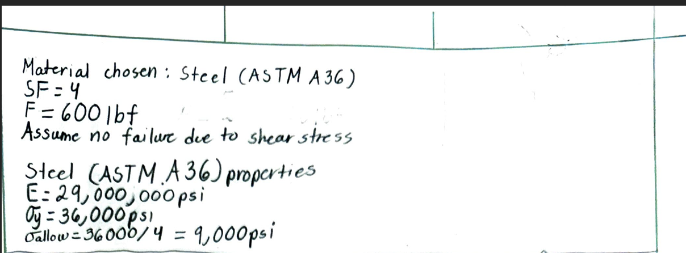
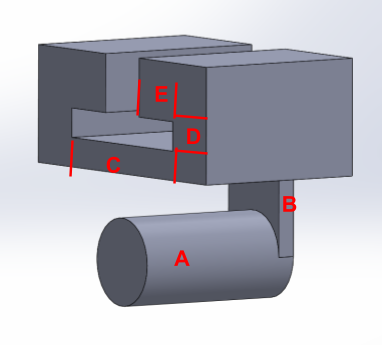
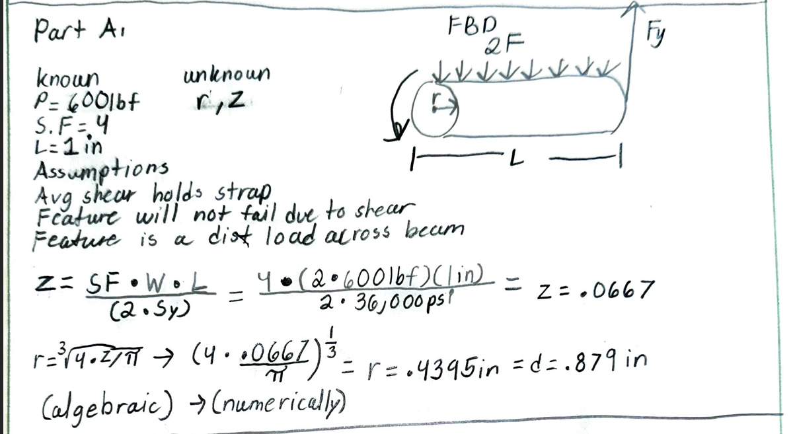
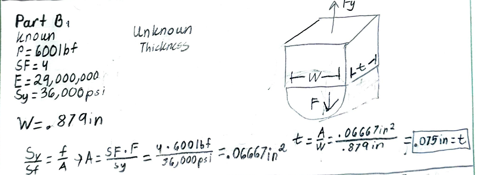
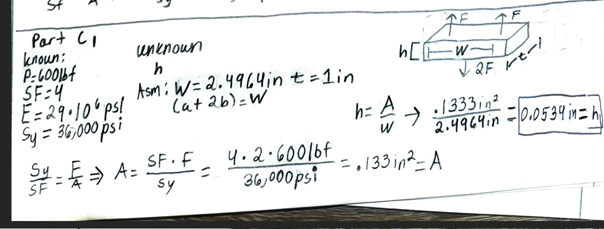
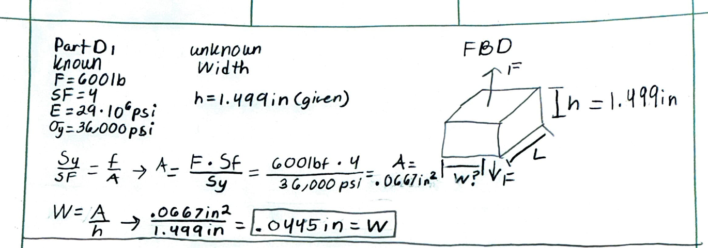
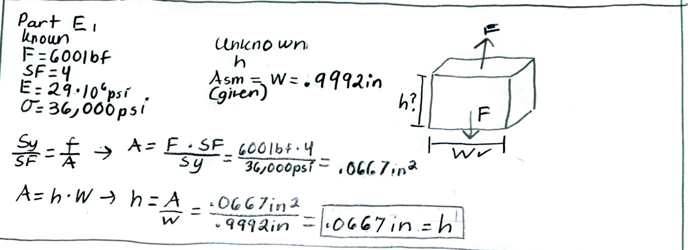

# A5 – Bracket design

## Objective
Objectives:
- Conduct stress analysis to determine appropriate dimensions for structural features.
- Generate free-body diagrams (FBDs) to visualize forces and constraints for each feature.\
- Identify and document known and unknown variables, assumptions, and algebraic models for stress calculations.
- Perform stiffness analysis to establish minimum required dimensions based on deflection constraints.
- Compare stress and stiffness analyses to ensure structural integrity and compliance with given constraints.
- Create detailed multiview sketches illustrating dimensions derived from both stress and stiffness analyses.
- Reflect on and document key engineering lessons learned throughout the process.

## Design Process
For my project, I chose a 600 lbf force on all features; Feature A's force doubled because of how the strap is run around the pin. I chose Steel (ASTM A36) with a safety factor of 4. We were given a deflection of .005in, and the properties of steel are a yield strength of 36,000 psi and a modulus of elasticity of 29,000,000 psi. Also, since I'm in 2157, I had to design a link with a running/sliding fit. 

### Bracket Separations

# Part 1: Stress Analysis

**Part A**

For Part A, I began by identifying the forces acting on the feature and creating a free-body diagram to establish the loading condition. Because of the way the strap is routed around the pin, this feature experiences a 1200 lbf load. I then used the material properties of ASTM A36 steel and the required safety factor of 4 to determine the allowable stress. 

**Part B**

For Part B, I analyzed the feature using the same general design process. I first identified the loading and constraints using a free-body diagram. The applied forces were then used to develop the equations needed to determine the required dimensions.

**Part C**

Part C required another analysis of the bracket geometry to determine the dimensions necessary to safely support the applied loading. I used the known material properties and safety factor to establish the allowable stress before performing the stress calculation.

I then compared the stress-based dimension with the dimension required from the stiffness analysis. This comparison helped determine which requirement controlled the final geometry. The resulting dimensions were incorporated into the CAD model.
aaaaaaaaaaaaaaaaaaaaaaaaaaaaaaaaaaaaaaaaaaaaaaaaaaaaaaaaaaaaaaaaaaaaaaaaaaaaaaaaaaaaaaaaaaaaaaaaaaaaaaaaaaaaaaaaaaaaaaaaaaaaaaaaaaaaaaaaaaaaaaaaaaaaaaaaaaaaaaaaaaaaaaaaaaaaaaaaaaaaaaaaaaaaaaaaaaaaaaaaaaaaaaaaaaaaaaaaaaaaaaaaaaaaaaaaaaaaaaaaaaaaaaaaaaaaaaaaaaaaaaaaaaaaaaaaaaaaaaaaaaaaaaaaaaaaaaaaaaaaaaaaaaaaaaaaaaaaaaaaaaaaaaaaaaaaaaaaaaaaaaaaaaaaaaaaaaaaaaaaaaaaaaaaaaaaaaaaaaaaaaaaaaaaaaaaaaaaaaaaaaaaaaaaaaaaaaaaaaaaaaaaaaaaaaaaaaaaaaaaaaaaaaaaaaaaaaaaaaaaaaaaaaaaaaaaaaaaaaaaaaaaaaaaaaaaaaaaaaaaaaaaaaaaaaaaaaaaaaaaaaaaaaaaaaaaaa

**Part Caaaaaaaaaaaaaaaaaaaaaaaaaaaaaaaaaaaaaaaaaaaaaaaaaaaaaaaaaaaaaaaaaaaaaaaaaaaaaaaaaaaaaaaaaaaaaaaaaaaaaaaaaaaaaaaaaaaaaaaaaaaaaaaaaaaaaaaaaaaaaaaaaaaaaaaaaa**

For Part D, I continued the same process by developing a free-body diagram and identifying the relevant forces, dimensions, and constraints. The calculated loading was used to determine the required structural dimensions while maintaining the specified safety factor.

After completing the stress analysis, I checked the design for the required stiffness. This ensured that the final geometry was not only strong enough to prevent failure but also stiff enough to remain within the specified deflection limit.

**Part E**

## Decide

## Communicate

