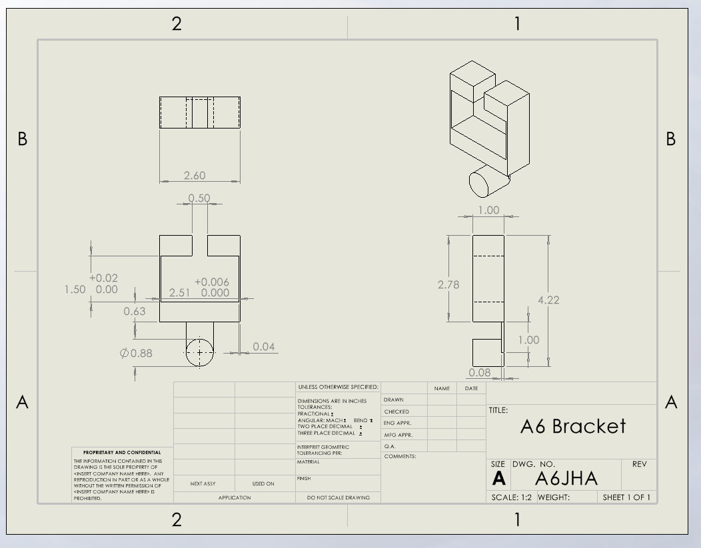
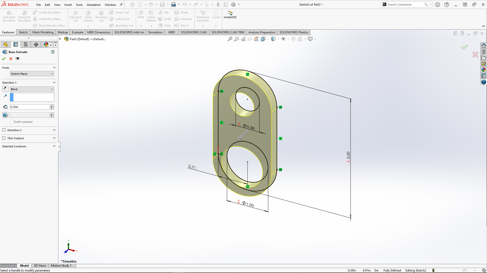
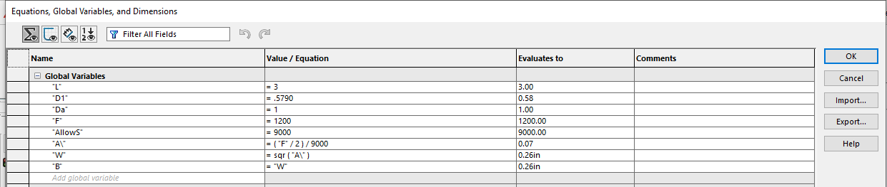
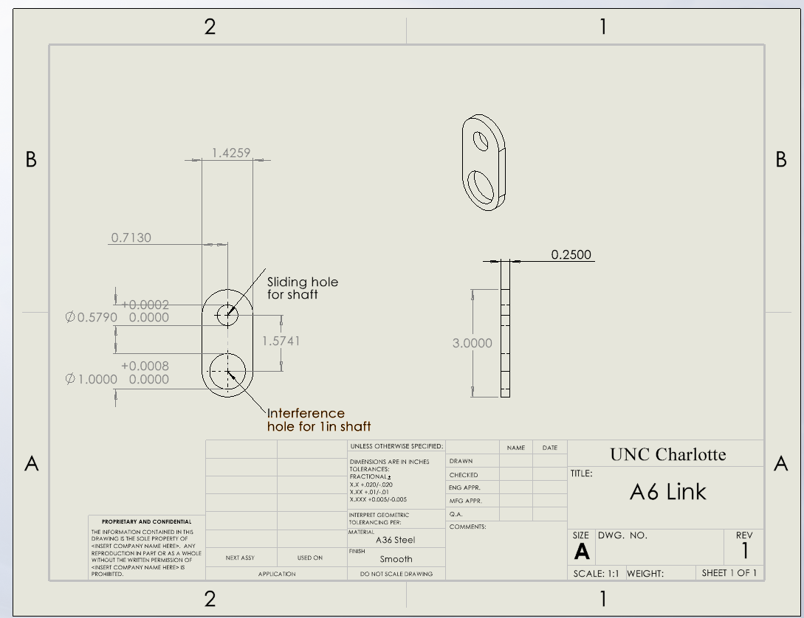

# A6 – Bracket Drawing (Drawings Part 1)

## Objective
The objective of this assignment was to advance the parametric design of the bracket developed in the previous project by incorporating precision sliding fits and creating a fully detailed engineering drawing. The design process focused on applying the stress and tolerance requirements determined in A5 to the CAD model. The final model and drawing were developed to accurately represent the functional geometry, assembly interfaces, dimensions, and tolerances required for manufacturing.

## Parametric Design

All of the dimensions were gathered from A5 using the stress calculations. Parts C and E will be different because I realized a crucial mistake and fixed it in my actual part. 

For my design, I went with the same structure that was given in A5, started with Part A and went all the way until Part E. While doing this, I was also declaring my assumed and determined variables. 

 

## Drawing 

## 2157 Section
This is my work for the link using dimensions from last week. 

## Reflection 

I later found an error in my A5 calculations because I had used the wrong formulas. This affected Parts C and E of the design. After correcting the input parameter, the dimension for Part E changed from 0.0667 in to 0.6481 in. Features that referenced this dimension, such as the height, updated automatically with the change. This showed me the importance of establishing proper relationships between dimensions and features in a parametric model. A model can only respond to design changes as completely as the relationships within the model allow. Features that are dimensioned independently of their driving equations can become areas where an error remains even after the primary design parameter has been corrected.

Tolerance as a consequence of function. On the drawing, I applied [tight tolerance, e.g., ±.005] to the pin bore because it is a mating function where clearance directly determines whether the parts assemble and move as intended. I applied [loose tolerance, e.g., ±.02] to [feature, e.g., the overall bracket length] because it is a non-critical feature that does not mate with another part, so variation there does not affect function. Holding a non-critical feature to a tight tolerance would force slower machining, additional finishing operations, tighter inspection, and a higher scrap rate, raising cost without improving performance. Tolerance should be assigned feature by feature according to function.

While working on the link, I learned how important proper tolerancing is for ensuring part-to-part compatibility. Tolerances allow mating parts to fit together as intended while controlling how much variation can be accepted during manufacturing. I also learned that dimensioning and tolerancing communicate the design intent and functional requirements to the machinist. A drawing should provide enough information to manufacture the part accurately without being unnecessarily complicated or overloaded with dimensions. Clear dimensions and appropriate tolerances reduce manufacturing errors and help ensure that the finished part meets the intended design requirements.

## CAD Files & Drawings

