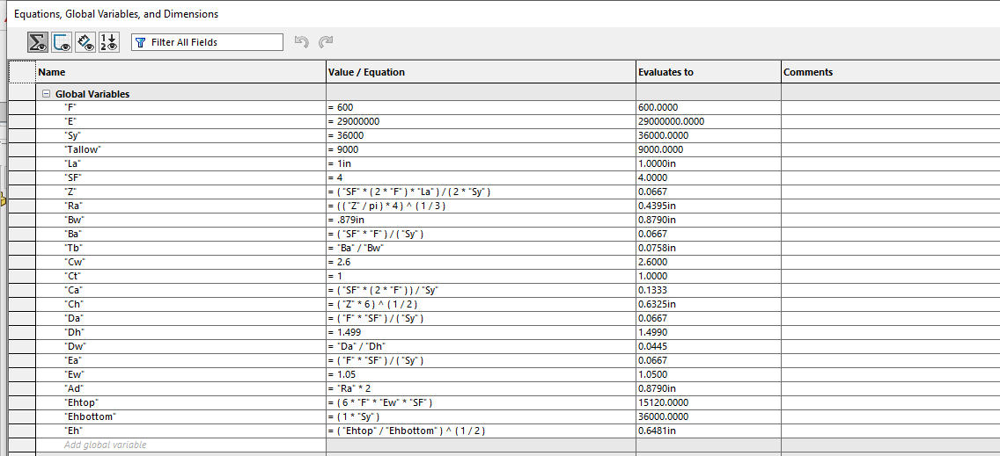
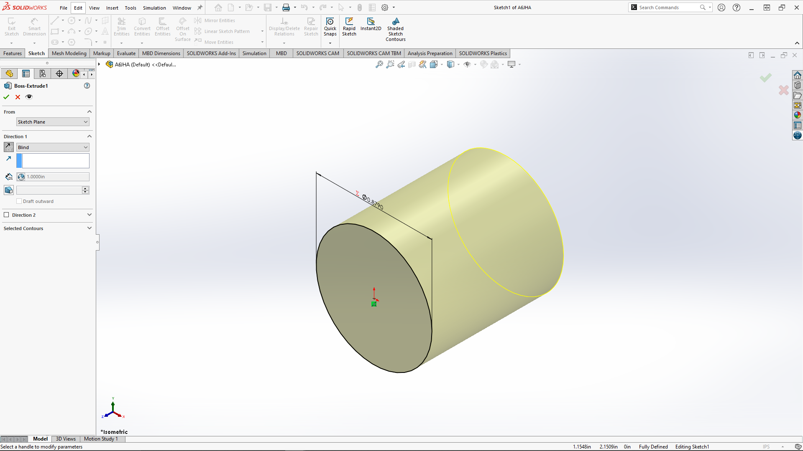
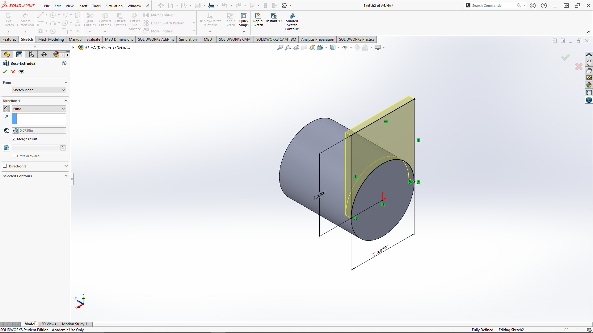
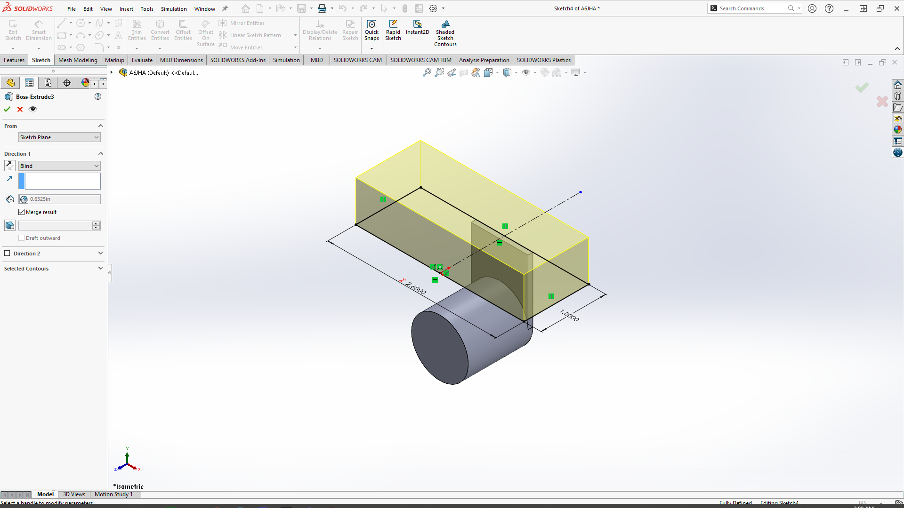
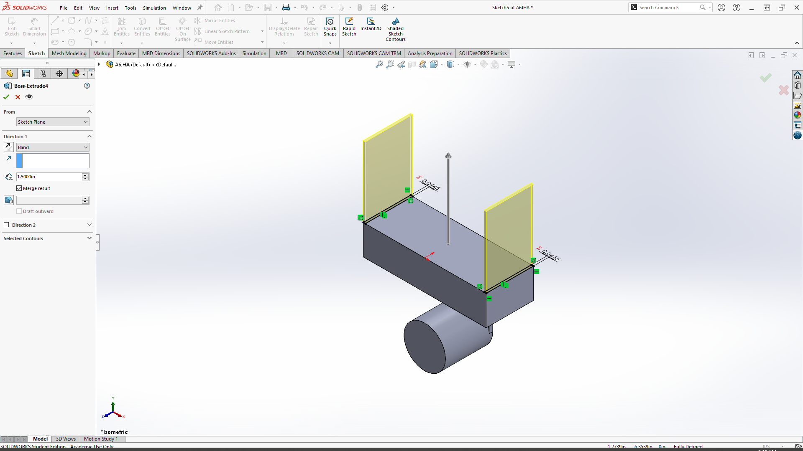
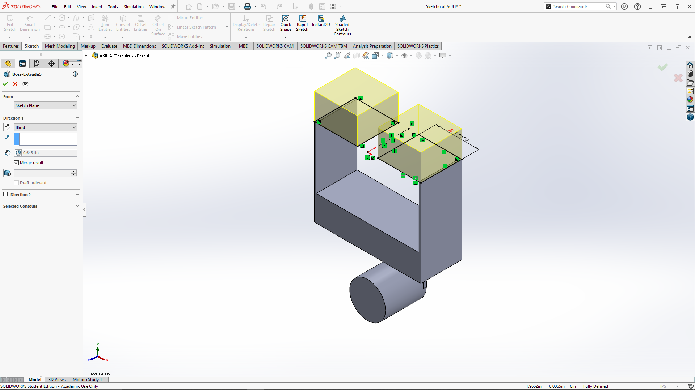
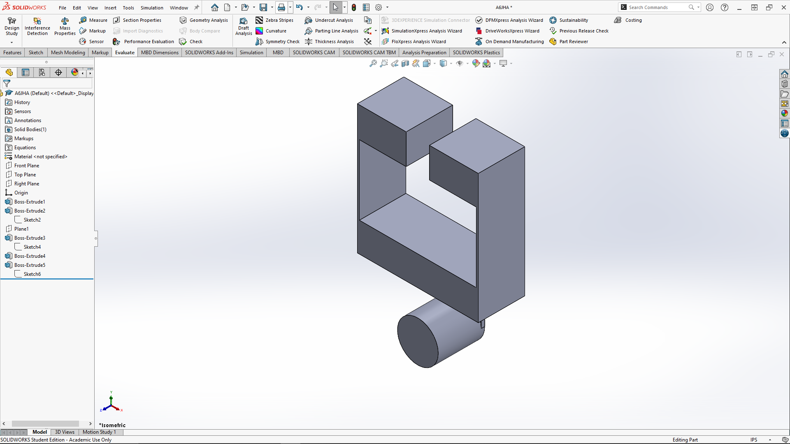

# A6 – Bracket Drawing (Drawings Part 1)

## Objective
The objective of this project was to continue from last week's project using the bracket. This time, accounting for fits, along with making an engineering drawing that accurately represents your bracket and displays proper tolerances found from the book.

## Parametric Design
All of the dimensions were gathered from A5 using the stress calculations. Parts C and E will be different because I realized a crucial mistake and fixed it in my actual part. 

For my design, I went with the same structure that was given in A5, started with Part A and went all the way until Part E. While doing this, I was also declaring my assumed and determined variables. 

 

## Drawing

![Drawing]

## Reflection 

One engineering lesson learned from this assignment was the importance of connecting the analytical design calculations directly to the parametric CAD model. The strength calculation from A5 was used to determine the required dimension of the bracket based on the allowable stress. Instead of treating the calculated dimension as an isolated value, the dimension was incorporated into the parametric model so that it controlled the corresponding feature of the bracket. This allowed the CAD model to remain connected to the engineering design requirements.

During the assignment, I also discovered an error in the original design that affected Parts C and E. After identifying the mistake, I corrected the calculation and updated the corresponding dimensions in the model. Because the model was parametrically defined, the related geometry could respond to the updated dimension rather than requiring the entire bracket to be manually remodeled. This demonstrated the value of using relationships and parameters in CAD: when an engineering requirement changes, the model can adapt while maintaining the intended design relationships.

